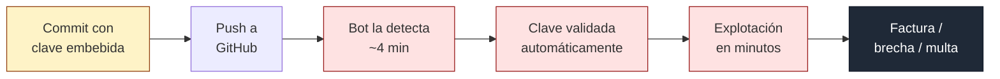
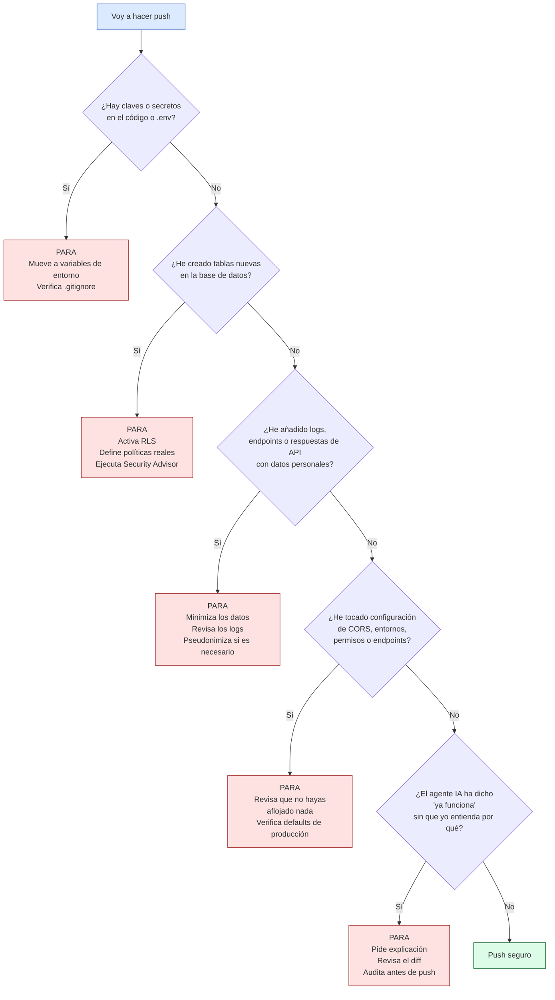

# Guía de Seguridad para PMs que construyen con Claude Code

**Entregable del curso AI PM Pro · The Hero Camp**  
Sesión "Seguridad y buenas prácticas en desarrollo con IA"

---

## Cómo usar esta guía

Esta no es una guía de lectura única. Es una referencia operativa: vuelve a ella antes de hacer push a producción, cuando un cliente pregunte por privacidad, cuando algo no encaje bien en la arquitectura.

Está organizada en **cuatro familias de riesgo** (credenciales, base de datos, datos sensibles, configuración) y un **checklist práctico** al final. Las familias te dan el marco conceptual; el checklist, la acción concreta.

Si tienes cinco minutos, ve al checklist. Si tienes quince, lee también los principios. Si tienes una hora, léela entera.

---

## Lo que ocurre cuando se rompe: timeline típico

Antes de las familias, necesitas ver qué pasa realmente cuando falla algo. Los tiempos son reales:



El punto clave: **no hay margen de reacción en horas o días. Tienes minutos.**

---

## Familia 1 — Credenciales y secretos

**Qué son.** Cualquier cadena que autentica tu aplicación contra un servicio: API keys (Google, OpenAI, AWS), tokens, credenciales de base de datos, secretos de aplicación.

**Por qué fallan con agentes IA.** El agente está optimizado para que el código funcione. Cuando hay error de permisos, tiende a resolverlo con la credencial de máximo acceso. Hardcodea la clave "temporalmente" y el refactor nunca ocurre.

**Lo que duele.**

- El 70% de los secretos filtrados en 2022 continuaban activos en 2025 (sin rotación).
- Los repositorios privados son 9x más propensos a contener secretos que los públicos.
- Tiempo promedio desde exposición a explotación: 4-5 minutos.

**Qué tienes que hacer.**

1. No pongas claves directamente en código. Usa variables de entorno (`process.env.API_KEY`).
2. Verifica que `.env` está en `.gitignore` **antes** del primer commit.
3. Distingue entre claves públicas (anon keys, identificadores) y claves privadas (service role, AWS IAM, OpenAI). Las privadas solo en servidor.
4. Aplica mínimo privilegio: cada clave solo los permisos que necesita. No `AdministratorAccess` porque "funciona".
5. Configura límites de gasto duros en servicios que cobran por uso (Gemini, OpenAI, AWS). Es tu red de seguridad.
6. Si una clave se expone, trátala como comprometida desde ese momento. Rota inmediatamente.
7. Usa un pre-commit hook que bloquee commits con patrones de secretos (gitleaks, git-secrets).

**Pregunta para hacerse.** Cuando el agente dice "ya funciona": ¿funciona porque está bien construido, o porque quitó un obstáculo de seguridad?

---

## Familia 2 — Bases de datos y permisos

**Qué son.** Las reglas que deciden quién puede leer, escribir, modificar o borrar qué datos. En Supabase (PostgreSQL), se llama Row Level Security o RLS.

**Por qué fallan con agentes IA.** Supabase crea tablas con RLS **desactivado por defecto**. Los agentes IA usan migraciones automáticas que heredan este valor. Cuando subes la anon key al frontend (correcto por diseño), esa clave se convierte en la llave maestra de una base de datos sin cerraduras.

**Lo que duele.**

- **CVE-2025-48757 (junio 2025)**: más de 170 aplicaciones construidas con Lovable tenían Supabase completamente accesible por falta de RLS. ~13.000 usuarios expuestos.
- El 40% de las claves de acceso expuestas en repos públicos corresponden a bases de datos.
- Aproximadamente el 50% de configuraciones de RLS son "USING (true)" (seguridad cosmética).

**Qué tienes que hacer.**

1. Activa RLS en **todas** las tablas. No asumas que está activado: verifica.
2. RLS solo funciona si las políticas filtran de verdad. Una política `USING (true)` es seguridad cosmética.
3. Ejecuta el Security Advisor de Supabase antes de cada despliegue. Lista automáticamente tablas sin RLS.
4. Nunca uses `service_role` key en el cliente. Nunca la subas a repo, nunca la pegues en Slack o tickets.
5. Si conectas un agente IA a tu BD (vía MCP u otra integración), dale permisos mínimos y modo read-only. Nunca `service_role`.
6. Verifica desde fuera como lo haría un atacante:
   ```bash
   curl -H "apikey: TU_ANON_KEY" \
     "https://PROYECTO.supabase.co/rest/v1/tu_tabla?select=*"
   ```
   Si devuelve datos, no tienes RLS correctamente configurado.

**Pregunta para hacerse.** Si publicara mi anon key en Reddit ahora, ¿qué información podría extraer cualquiera de mi base de datos?

---

## Familia 3 — Datos sensibles y privacidad

**Qué son.** Cualquier información sobre una persona identificable: emails, teléfonos, direcciones, IPs, user IDs, localización, historial de uso. Bajo RGPD, un email suelto ya es dato personal.

**Por qué fallan con agentes IA.** El agente mueve datos a sitios donde no hay protección de producción. Logs con objetos completos de usuario. Dumps pegados en Slack para depurar. Datos copiados al contexto del LLM para "que entienda el problema". Cada acción crea una copia del dato sin protecciones.

**Lo que duele.**

- **20% de las brechas de datos en 2025 tuvieron "shadow AI" involucrada** (uso de ChatGPT, Claude web por empleados sin autorizar). Coste extra: 670K dólares por incidente (IBM Cost of a Data Breach 2025).
- El 29% de empresas usan datos reales de producción en testing. El 45% ha sufrido una brecha relacionada.
- **443 notificaciones diarias de brechas en Europa en 2025** (DLA Piper 2026). Multas RGPD acumuladas desde 2018: 7.100M euros.
- El 97% de brechas relacionadas con IA ocurrieron en entornos sin controles de acceso adecuados para IA.

**Qué tienes que hacer.**

1. Trata cualquier email, user_id, IP como dato personal. RGPD aplica desde el primer usuario real, no cuando "pases a producción oficial".
2. Revisa tus logs. Nunca loggear objetos completos de usuario, nunca payloads completos de requests, nunca respuestas de API con datos. Cuando veas `console.log(user)`, quítalo antes de push.
3. No uses datos reales para desarrollo. Usa datos sintéticos o pseudonimizados. Si necesitas reproducir un bug con datos reales, hazlo puntualmente y borra después.
4. **Nunca pegues datos reales en el contexto de un LLM externo** (ChatGPT, Claude web, Gemini). Viajan al proveedor y muchos los retienen por defecto.
5. Ten una política de privacidad accesible desde el día uno. No tiene que ser perfecta, pero tiene que existir.
6. Aprende el plazo: **72 horas para notificar una brecha** a la autoridad de protección de datos desde que tienes constancia. Tener un procedimiento mínimo listo ("a quién llamo, qué información reúno") te evita improvisar bajo presión.

**Pregunta para hacerse.** Si mañana se filtra esta tabla/log/archivo, ¿a quién tengo que llamar y qué tengo que explicar?

---

## Familia 4 — Entornos, despliegues y configuración

**Qué son.** Variables de entorno, permisos, políticas CORS, endpoints expuestos, buckets de almacenamiento, flags de debug, cabeceras HTTP. Todo lo que determina comportamiento sin ser código.

**Por qué fallan con agentes IA.** El agente hereda configuraciones permisivas del entorno de desarrollo y las replica en código nuevo. Resuelve errores aflojando la configuración ("pon CORS en `*`"). La configuración no se revisa como el código, porque no produce errores observables cuando está mal. La deuda se acumula silenciosamente.

**Lo que duele.**

- **Gartner predice que el 99% de los fallos cloud hasta 2026 serán culpa del cliente, no del proveedor.**
- Las misconfiguraciones son la segunda causa de brechas después del phishing.
- Casi el 50% de todos los buckets S3 están potencialmente mal configurados. Más del 50% contienen datos sensibles.
- La empresa media tiene más de 3.000 activos cloud mal configurados en cualquier momento.

**Qué tienes que hacer.**

1. Distingue entornos claramente. Nunca uses defaults de desarrollo en producción. Si una variable crítica falta, **el sistema debe fallar ruidosamente**, no usar un default permisivo.
2. Endurece defaults. CORS: allowlist estricta en endpoints autenticados, nunca `*`. Debug: siempre desactivado en producción. Usa Helmet o equivalente.
3. Cierra endpoints auxiliares. Revisa si tienes activos `/api-docs`, `/health`, `/actuator`, `/swagger`, `/debug`. Desactívalos o protégelos.
4. Buckets de almacenamiento: privados por defecto. Si un archivo tiene que ser público, genera URL temporal firmada, no hagas público el bucket entero.
5. Revisa la configuración periódicamente (una vez al mes, una vez por sprint). Lo que no se revisa se degrada.
6. Usa herramientas automáticas. El pipeline de auditoría de esta sesión, Supabase Security Advisor, tfsec, gitleaks.

**Pregunta para hacerse.** Si un investigador de seguridad escaneara mi dominio desde fuera ahora, ¿qué encontraría?

---

## Los cinco principios transversales

Si tuviera que resumir las cuatro familias en cinco principios que apliquen a todas:

**Principio 1: "Que funcione" no es "que esté bien".**  
Cuando el agente dice que algo ya funciona, pregúntate si funciona porque está bien construido o porque quitó un obstáculo de seguridad.

**Principio 2: Velocidad sin defensas es velocidad hacia el incidente.**  
Claude Code multiplica tu capacidad de construir. El pipeline de auditoría que construimos en clase es la capa defensiva que equilibra la ecuación.

**Principio 3: Repositorios privados no son un refugio.**  
El 35% de repos privados contienen secretos. Trata cualquier credencial expuesta como comprometida, independientemente de dónde esté.

**Principio 4: El desconocimiento regulatorio no exime del cumplimiento.**  
RGPD aplica desde el primer usuario real. "Estamos en beta" no es excusa. Un mínimo de higiene es obligatorio.

**Principio 5: Lo que no se revisa se degrada.**  
La configuración, los permisos, las claves, los endpoints: todo empeora si no lo revisan activamente. Automatiza con el pipeline; asume que tu atención humana no es suficiente.

---

## Checklist operativo: antes de hacer push

Úsalo como rutina mental antes de subir código que toque base de datos, variables de entorno, autenticación o configuración de despliegue.



Cinco preguntas. Si alguna es "sí", para y revisa. Si las cinco son "no" o ya revisaste, haz push tranquilo.

---

## Tres acciones para esta semana

1. **Revisa las tablas de tu base de datos.** Ejecuta Supabase Security Advisor. Anota cuántas tablas están sin RLS correctamente configurado.

2. **Audita un endpoint reciente con el agente.** Pídele a Claude Code que revise un endpoint que creaste esta semana y te diga si expone más datos de los necesarios, si tiene autenticación, si loggea información sensible.

3. **Configura un límite de gasto.** Si usas Gemini, OpenAI, AWS o similar, define hoy un límite mensual duro. Es tu red de seguridad.

---

## Cuándo necesitas ayuda profesional

El pipeline cubre los riesgos frecuentes. No cubre todos. Hay cinco escenarios donde tienes que parar y traer a un ingeniero de seguridad:

1. **Datos de salud, financieros o biométricos.** Cualquier producto bajo HIPAA, PCI-DSS o categorías especiales de RGPD necesita revisión profesional.

2. **Crecimiento súbito de usuarios.** Si pasas de 100 a 10.000 usuarios en pocas semanas, la superficie de ataque cambia.

3. **Integraciones con sistemas críticos.** Si conectas a sistemas bancarios, sanitarios, gubernamentales.

4. **Procesamiento de pagos.** Incluso usando Stripe, tu manejo del entorno es tu responsabilidad.

5. **Auditorías o cumplimiento formal.** Si un cliente, inversor o regulador pide una auditoría, contrata a un profesional.

Cuando escribas a un experto, cuéntale:
- Qué producto tienes y qué stack usas.
- Qué datos maneja el sistema.
- Cuántos usuarios y qué volumen de operaciones.
- Qué ya revisaste (pipeline, Security Advisor, otras herramientas).
- Qué escenario concreto te preocupa.

Cuanto más concreto, mejor será la revisión.

---

## Recursos y referencias

**Herramientas operativas (úsalas el lunes):**
- Supabase Security Advisor (integrado en el dashboard)
- gitleaks o git-secrets (pre-commit hooks para secretos)
- TruffleHog (escaneo de repos)
- Pipeline de auditoría de esta sesión (entrega al final)

**Estándares de referencia:**
- OWASP Top 10 y OWASP API Security Top 10
- CWE Top 25 (Common Weakness Enumeration)
- NIST Cybersecurity Framework

**Informes y estudios:**
- GitGuardian State of Secrets Sprawl 2026
- IBM Cost of a Data Breach Report 2025
- DLA Piper GDPR Fines and Data Breach Survey 2026
- Gartner Magic Quadrant: Cloud-Native Application Development

---

**Fin de la guía.**

Si algo aquí te resulta confuso o quieres discutir cómo aplicarlo a tu proyecto, el canal de Slack del curso y las mentorías son para eso. Y si después de leer esto crees que tu proyecto actual tiene varios de estos problemas, es normal. Casi todos los tienen. Lo importante es tener el mapa mental para resolverlos uno por uno.

Buena suerte construyendo.
